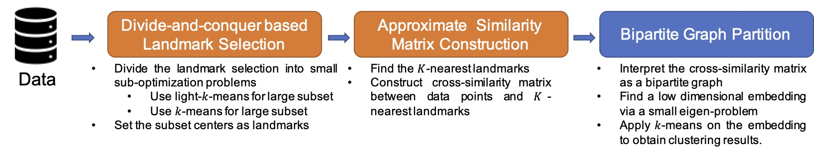
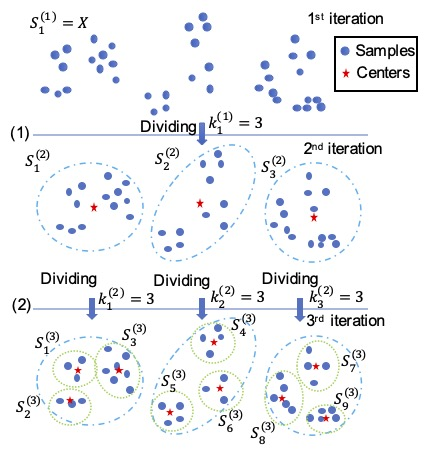

# Divide-and-conquer based Large-Scale Spectral Clustering

## Datasets
Five real world datasets and five synthetic datasets:

- USPS 
- PenDigits 
- Letters 
- MNIST 
- Covertype 
- Three Spirals-60K (TS-60K)
- Two Moons-1M (TM-1M)
- Three Circles-6M (TC-6M)
- Circles and Gaussian-10M (CG-10M) 
- Flower-20M (FL-20M) 

## Algorithm 

- [Divide-and-conquer based Large-scale Spectral Clustering](DnC_SC.m)

    - [Divide-and-conquer based Landmark Selection](DnC_landmark)
    
    <!-- - [light-k-means](figs) -->
    - Approximate K-nearest landmarks method (line 35~62 of [DnC_SC](DnC_SC.m))
    

## Code 

See our [demo](demo.m).
