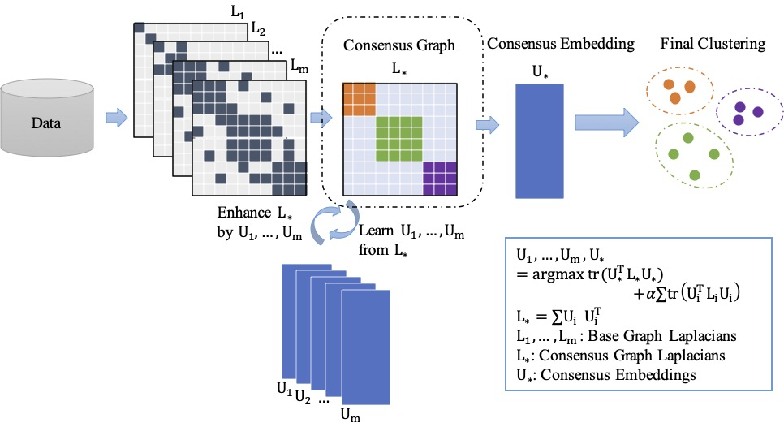

# Large scale spectral clustering using sparse representation based on hubness

This repository is for the replication of our published paper Ensemble Learning for Spectral Clustering on [ICDM 2020](https://doi.org/10.1109/ICDM50108.2020.00131). 

You also can find our paper [here](https://www.computer.org/csdl/pds/api/csdl/proceedings/download-article/1r54GbKzRdu/pdf?casa_token=TR0byuGEKUQAAAAA:Aj1qb5k4mf5Jc6mZvuoHbvxaFrEekG7_MrA_oIeo8KttO_H4zn5l601dIOs9bEV-Ck44KUBVt0Q).


## Algorithm 
- [ELSC.m](ELSC.m)


## Code 
See our [demo](demo.m).


# Reference
If you find this code useful for your research, please cite
```
@inproceedings{li2020ensemble,
  title={Ensemble Learning for Spectral Clustering},
  author={Li, Hongmin and Ye, Xiucai and Imakura, Akira and Sakurai, Tetsuya},
  booktitle={2020 IEEE International Conference on Data Mining (ICDM)},
  pages={1094--1099},
  year={2020},
  organization={IEEE}
}
```